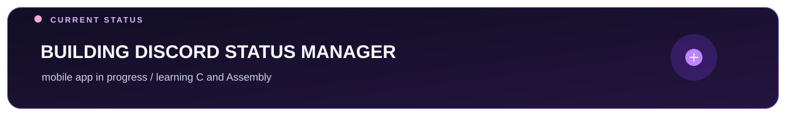
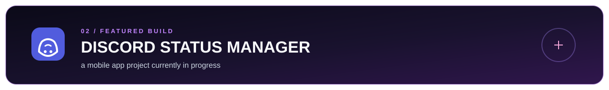
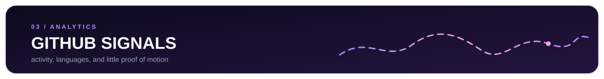

<!-- ═══════════════════════════ HEADER ═══════════════════════════ -->

  

<table>
<tr>
<td width="28%" align="center" valign="middle">

</td>
<td width="72%" valign="middle">

  <strong>HARUKI / LIME</strong> 
  Curious developer exploring low-level fundamentals and expressive software.

  
  &emsp;
  
  &emsp;
  

</td>
</tr>
</table>

 

 

<!-- ═══════════════════════════ ABOUT ═══════════════════════════ -->

  

I’m **Haruki**, also known as **Lime** — a curious developer exploring the space between low-level fundamentals and expressive software.

  Diving deeper into <strong>C</strong> and <strong>Assembly</strong> · fueled by curiosity, coffee, and clean code · always open to a thoughtful conversation.

 

 

<!-- ═══════════════════════════ STATUS ═══════════════════════════ -->

  

  

 

 

<!-- ═══════════════════════════ TECH STACK ═══════════════════════════ -->

## `~/tech-universe`

### Languages

  

### Frameworks & Runtime

  

### Cloud & Deployment

  

### Databases & Tools

 

 

<!-- ═══════════════════════════ PROJECTS ═══════════════════════════ -->

  

  

 

 

<!-- ═══════════════════════════ ANALYTICS ═══════════════════════════ -->

  

&nbsp;

  

 

 

<!-- ═══════════════════════════ FOOTER ═══════════════════════════ -->

  

> “A fool admires complexity. A genius admires simplicity.”

 

  

